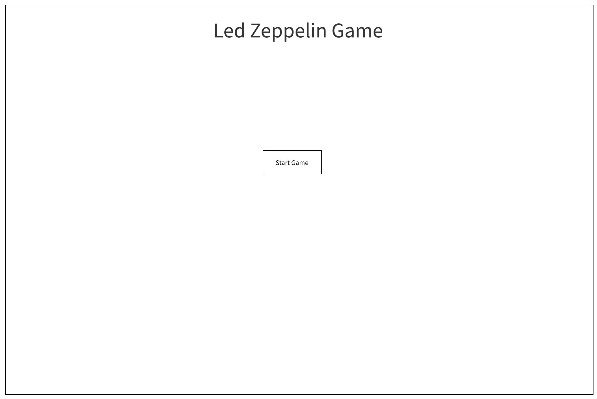
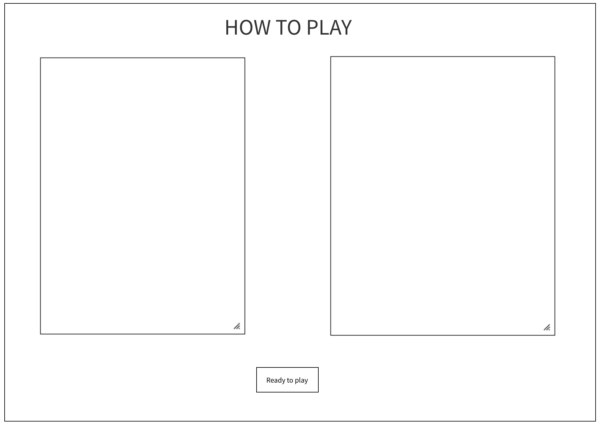

# Led Zeppelin Game

## Concept: 

Game begins by displaying the title, and two buttons which you can select from. You can also select to play some music if you would like to make this game experience more fun

Clicking on the "Let's Play" button will initialize this game, which will then prompt you an input for you to type your name. <strong><em>WARNING!</em></strong> You must type a name. If you don't have one then make one up.

Once you've got that down, you will be directed to click a couple more buttons before reaching the 'How To Play' screen. On this screen you will see what the winning conditions and also learn a bit more about the cards.

The button on the instructions will then move you to the main game board, and this is where the cards are dealt.

First person to lose their life loses. At the end you will be prompted to reset the board which will take you to the start of the game.

## Wireframes:

## Technologies Used:
    - HTML
    - CSS 
    - JavaScript
    - JQuery
    - Bootstrap 5.0
    - MockFlow
    - FontAwesome

## Approach: 

The approach I used to make this game was a sequence of <em>Pseudocode, CSS, and JQuery</em>. I began writing out all the plans I had to make this game work and the daily goals I set myself for completing it. 

First, by building the layout with CSS and with Bootstrap, I managed to give myself a good head start into my project. Then, once I had most of my layout completed I began introducing eventListeners for buttons that would show and hide elements that I already had. 

Then, I added all of the card information and saved it into an object with the three main characteristics of all cards. This helped for calling a random card with attributes that pertained to that one card. 

Next, I appended information to empty tags (divs, p, h2) that were placed on my HTML page based on the results of the user response to the button clicked. 

Finally, I introduced a main menu/reset button which would take the user back to the original page whilst playing the music.

## Challenges: 

The greatest challenges that I came accross were how to make a game that would interact well with different screen sizes. The game works best on a desktop screen.

I also had many problems with the reset button due to it not replacing the information that I needed it to replace.

Finally, I had issues with the cards not staying in one place when flipping, they seem to want to edge about a millimeter to the left when hovered over.

## Additional information:

For now this game is a 1 vs. CPU game, but in the future it will be made to interact with two or more players. 

Never drink and drive by the way!

## App Demo 
[Led Zeppelin Game](https://sepaivaluna.github.io/game.html)